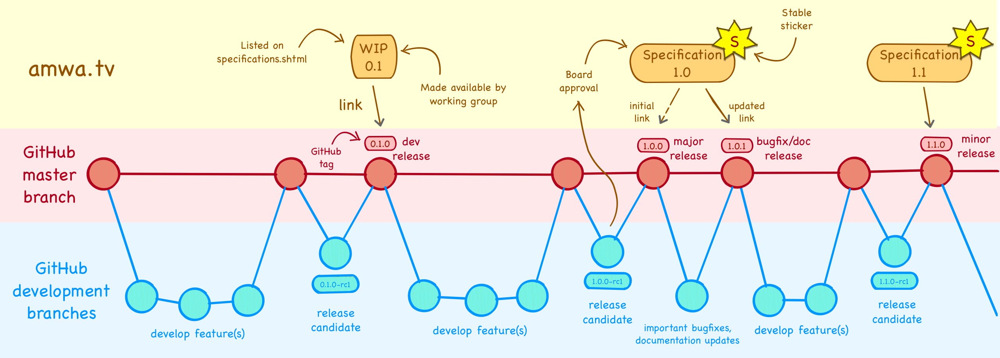

# Example AMWA Informative Specification v1.0

This is a dummy specification to demonstrate AMWA's process, as applied to a development workflow, using GitHub and semantic versioning.

## Why does this exist?

AMWA's [BCP-001] describes a process for developing AMWA specifications:

- Build up as as Work In Progress (WIP)
- Elevate to Proposed Specification when "ready to implement".
- Elevate to Specification when implementations are mature

AMWA are currently looking at a possible revision to BCP-001 that suits the "API" nature of many specifications (such as NMOS IS-04/05/06). It should make it easier to answer questions such as:

 - When should I start implementing?
 - How do I know it won't change in the future?
 - Which specifications are required with / work with which?

## What will the new process be like?

The "Proposed Specification" stage will be removed, and a new "stable sticker" introduced, that can be applied to Specifications. The meaning of that sticker is project-dependent, but one possibility is that it could be similar to the meaning of a major version number when using [semantic versioning](https://semver.org)

## Why do we need multiple versions of specs?

Two obvious reasons are to **add features** and **fix bugs** (problems) in the specification. For this example repository we'll keep lists of features and bug fixes in this README and update the lists as we make new versions. 

[This matrix](Version-matrix.md) shows which features are in which release.

## How does a GitHub repo such as this relate to what's on amwa.tv?

This approximately corresponds to this repo, and may help:

 .

## Features

- Aardvark
- Baboon

## Bug fixes (cumulative)

- Ant
- Bee
- Cicada
- Damselfly
- Earwig
- Flea

[//]: # (References/Links)

[BCP-001]: http://amwa.tv/projects/BCP-001.shtml "BCP-001: AMWA Specification Process"
